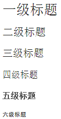

# 标题

用 Markdown 书写时，只需要在文本前面加上『#』即可创建一级标题。同理，创建二级标题、三级标题等只需要增加『#』个数即可，Markdown共支持六级标题。如下所示：
 
注：标准语法一般在#后跟个空格再写文字，并且#需要向左对齐才有效果

    # 一级标题 
    ## 二级标题
    ### 三级标题
    #### 四级标题
    ##### 五级标题
    ###### 六级标题

点击预览可以看到效果：

